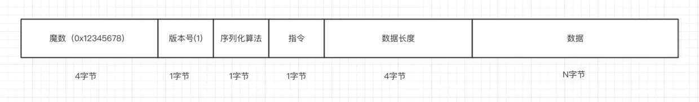
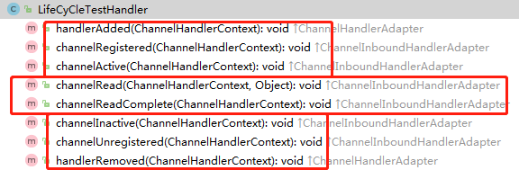

[TOC]
### Netty重点笔记
- 自定义编码协议-图片


#### NIO标准
```aidl
import java.nio.channels.Selector;
import java.nio.channels.SelectionKey;

import java.nio.channels.ServerSocketChannel;
import java.nio.channels.SocketChannel;

import java.nio.ByteBuffer;

import java.nio.charset.Charset;
```

#### Netty Server
```aidl
import io.netty.bootstrap.ServerBootstrap;

import io.netty.channel.nio.NioEventLoopGroup;

import io.netty.channel.socket.nio.NioServerSocketChannel;
import io.netty.channel.socket.nio.NioSocketChannel;
import io.netty.channel.ChannelInitializer;
import io.netty.channel.ChannelOption;

import io.netty.buffer.ByteBuf;
```

#### Netty Client
```aidl
import io.netty.bootstrap.Bootstrap;

import io.netty.channel.nio.NioEventLoopGroup;

import io.netty.channel.socket.nio.NioSocketChannel;
import io.netty.channel.ChannelInitializer;
import io.netty.channel.ChannelOption;

import io.netty.buffer.ByteBuf;
```

#### 数据读写容器 ByteBuf
```
import io.netty.buffer.ByteBuf;

capacity
maxCapacity
readerIndex
writerIndex

由于 Netty 使用了堆外内存，而堆外内存是不被 jvm 直接管理的，
也就是说申请到的内存无法被垃圾回收器直接回收，所以需要我们手动回收。
有点类似于c语言里面，申请到的内存必须手工释放，否则会造成内存泄漏。

release()、retain()
默认情况下，当创建完一个 ByteBuf，它的引用为1
然后每次调用 retain() 方法， 它的引用就加一
release() 方法原理是将引用计数减一，减完之后如果发现引用计数为0，
则直接回收 ByteBuf 底层的内存。

slice()、duplicate()、copy()

retainedSlice() 与 retainedDuplicate()
// retainedSlice 等价于
slice().retain()
// retainedDuplicate() 等价于
duplicate().retain()

```

#### 客户端与服务端通信协议编解码(序列化协议)
``` 
我们把 Java 对象根据协议封装成二进制数据包的过程成为编码，
而把从二进制数据包中解析出 Java 对象的过程成为解码

序列化+编码
反序列化+解码

```

#### Pipeline 与 ChannelHandler
``` 
无论是从服务端来看，还是客户端来看，在 Netty 整个框架里面，一条连接对应着一个 Channel，
这条 Channel 所有的处理逻辑都在一个叫做 ChannelPipeline 的对象里面，
ChannelPipeline 是一个双向链表结构，他和 Channel 之间是一对一的关系。

ChannelPipeline 里面每个节点都是一个 ChannelHandlerContext 对象，
这个对象能够拿到和 Channel 相关的所有的上下文信息，
然后这个对象包着一个重要的对象，那就是逻辑处理器 ChannelHandler。

ChannelHandler 分为 inBound 和 outBound 两种类型的接口，
分别是处理数据读与数据写的逻辑。

这个和python的scrapy框架的middleware中间件原理一样，就是一种责任链设计模式。

ChannelInboundHandler
ChannelInboundHandlerAdapter
ChannelOutboundHandler
ChannelOutboundHandlerAdapter

public class ChannelInboundHandlerAdapter extends ChannelHandlerAdapter implements ChannelInboundHandler
public class ChannelOutboundHandlerAdapter extends ChannelHandlerAdapter implements ChannelOutboundHandler

// 解码
import io.netty.handler.codec.ByteToMessageDecoder;
public abstract class ByteToMessageDecoder extends ChannelInboundHandlerAdapter
// 管道处理
import io.netty.channel.SimpleChannelInboundHandler<T>;
public abstract class SimpleChannelInboundHandler<I> extends ChannelInboundHandlerAdapter
// 编码
import io.netty.handler.codec.MessageToByteEncoder<T>;
public abstract class MessageToByteEncoder<I> extends ChannelOutboundHandlerAdapter
```

#### 拆包粘包
- Netty自带的拆包器
``` 
固定长度的拆包器 FixedLengthFrameDecoder
行拆包器 LineBasedFrameDecoder
分隔符拆包器 DelimiterBasedFrameDecoder
基于长度域拆包器 LengthFieldBasedFrameDecoder
```

- 拒绝非本协议连接(自定义编码协议的魔数)
``` 
自定义拆包器进行处判断过滤
public class Spliter extends LengthFieldBasedFrameDecoder
```

#### ChannelHandler Lifecycle 生命周期

```
public class LifeCyCleTestHandler extends ChannelInboundHandlerAdapter
```

#### Netty性能调优
- 1.共享 ChannelHandler
``` 
类上加注解@ChannelHandler.Sharable，并构造单例（前提是无状态）
```

- 2.压缩 ChannelHandler 合并编解码器
``` 
PacketDecoder & PacketEncoder -> PacketCodecHandler
```

- 3.缩短事件传播路径
``` 
压缩 ChannelHandler - 合并平行 ChannelHandler
然后构造成单例模式。

更改事件传播源 不太理解 先略过
```

- 4.减少阻塞主线程的操作
``` 
channelRead0() 这个方法里面的耗时操作不要放在这里
放在业务线程池中去处理，不再放在Netty的worker线程去处理
```

- 5.如何准确统计处理时长
```
protected void channelRead0(ChannelHandlerContext ctx, T packet) {
    threadPool.submit(new Runnable() {
        long begin = System.currentTimeMillis();
        // 1. 一些逻辑
        // 2. 数据库或者网络等一些耗时的操作
        // 3. writeAndFlush
        xxx.writeAndFlush().addListener(future -> {
            if (future.isDone()) {
                // 4. 其他的逻辑
                long time =  System.currentTimeMillis() - begin;
            }
        });
    })
}
```

#### 心跳与空闲检测
- 1.服务端空闲检测
``` 
public class IMIdleStateHandler extends IdleStateHandler {

    private static final int READER_IDLE_TIME = 15;

    public IMIdleStateHandler() {
        super(READER_IDLE_TIME, 0, 0, TimeUnit.SECONDS);
    }

    @Override
    protected void channelIdle(ChannelHandlerContext ctx, IdleStateEvent evt) {
        System.out.println(READER_IDLE_TIME + "秒内未读到数据，关闭连接");
        ctx.channel().close();
    }
}
```

- 2.客户端定时发心跳
``` 
public class HeartBeatTimerHandler extends ChannelInboundHandlerAdapter {

    private static final int HEARTBEAT_INTERVAL = 5;

    @Override
    public void channelActive(ChannelHandlerContext ctx) throws Exception {
        scheduleSendHeartBeat(ctx);

        super.channelActive(ctx);
    }

    private void scheduleSendHeartBeat(ChannelHandlerContext ctx) {
        ctx.executor().schedule(() -> {

            if (ctx.channel().isActive()) {
                ctx.writeAndFlush(new HeartBeatRequestPacket());
                scheduleSendHeartBeat(ctx);
            }

        }, HEARTBEAT_INTERVAL, TimeUnit.SECONDS);
    }
}
```

- 3.服务端回复心跳与客户端空闲检测
``` 
@ChannelHandler.Sharable
public class HeartBeatRequestHandler extends SimpleChannelInboundHandler<HeartBeatRequestPacket> {
    public static final HeartBeatRequestHandler INSTANCE = new HeartBeatRequestHandler();

    private HeartBeatRequestHandler() {

    }

    @Override
    protected void channelRead0(ChannelHandlerContext ctx, HeartBeatRequestPacket requestPacket) {
        ctx.writeAndFlush(new HeartBeatResponsePacket());
    }
}
```